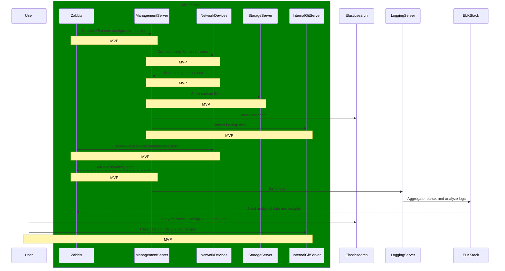
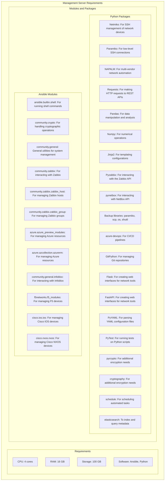
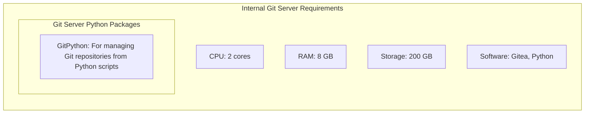
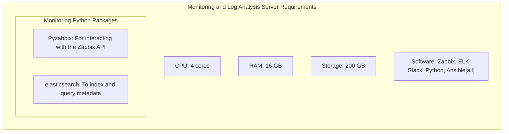
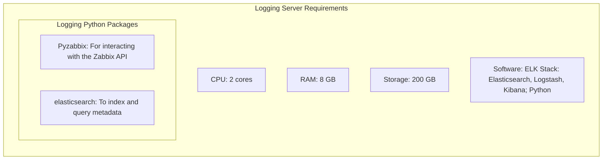
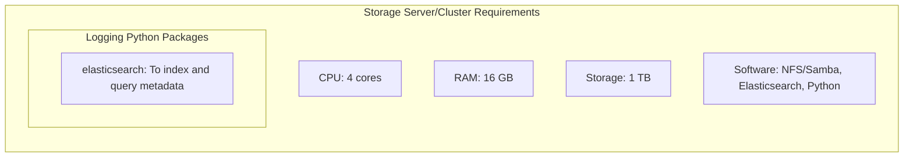

# Proposed Plan for NRE
### High-Level Explanation of System Interactions

The proposed system architecture consists of multiple servers working together to manage and store network configuration backups efficiently.

#### 1. **Management Server**

- **Role**: The Management Server orchestrates the backup processes, runs automation scripts, and interfaces with various network devices and services.
- **Key Interactions**:
  - **Internal Git Server**: Uses Git to store configuration backups and automation scripts. The Management Server commits configuration files to the Git repository for version control.
  - **Monitoring and Log Analysis Server**: Interfaces with Zabbix for network monitoring and retrieves inventory data. It can also push script execution results and logs to Zabbix for analysis.
  - **Logging Server**: Sends logs of backup processes and script executions to the Logging Server, which aggregates and analyzes these logs using the ELK Stack (Elasticsearch, Logstash, Kibana).
  - **Storage Server/Cluster**: Stores the actual configuration backup files. The Management Server saves these files directly to the Storage Server and updates the metadata in Elasticsearch for easy retrieval and querying.

#### 2. **Internal Git Server**

- **Role**: Manages version-controlled repositories for configuration backups and automation scripts.
- **Key Interactions**:
  - **Management Server**: Receives configuration backup files and scripts from the Management Server. Provides a version-controlled environment where changes can be tracked, and previous versions can be retrieved.

#### 3. **Monitoring and Log Analysis Server (Zabbix)**

- **Role**: Monitors network devices, manages inventory, and performs log analysis.
- **Key Interactions**:
  - **Management Server**: Provides inventory data and serves as the frontend for executing scripts on network devices. Receives execution results and status updates.
  - **Logging Server**: Receives aggregated log data for smart automation and detailed analysis.

#### 4. **Logging Server**

- **Role**: Aggregates and analyzes logs from various sources, providing insights into system operations and health.
- **Key Interactions**:
  - **Management Server**: Receives logs related to configuration backups and script executions.
  - **Monitoring and Log Analysis Server**: Sends analyzed log data and insights to Zabbix for comprehensive monitoring and smart automation.

#### 5. **Storage Server/Cluster**

- **Role**: Stores the actual configuration backup files and related large data sets.
- **Key Interactions**:
  - **Management Server**: Receives configuration backup files. These files are stored in the Storage Server, while metadata about the backups (such as timestamps, device details, and summaries) is indexed in Elasticsearch for quick retrieval and querying.
#
### Workflow Example


###

1. **Configuration Backup Process**:
   - The Management Server connects to network devices using Python libraries like Netmiko and NAPALM.
   - It retrieves the configuration data and stores the backup files on the Storage Server/Cluster.
   - Metadata about these backups (e.g., device name, timestamp) is indexed in Elasticsearch.
   - The backup files are also committed to the Internal Git Server for version control.

2. **Monitoring and Inventory Management**:
   - The Monitoring and Log Analysis Server (Zabbix) discovers network devices and maintains an inventory.
   - The Management Server retrieves inventory data from Zabbix to target specific devices for backups or updates.

3. **Log Aggregation and Analysis**:
   - The Management Server sends logs of backup processes and script executions to the Logging Server.
   - The Logging Server uses the ELK Stack to aggregate, parse, and analyze these logs.
   - Analyzed data and insights are sent to the Monitoring and Log Analysis Server for comprehensive monitoring.

4. **Query and Retrieval**:
   - Users can query the Elasticsearch instance on the Storage Server/Cluster to quickly find specific configuration backups based on metadata.
   - The version history and changes can be tracked using the Internal Git Server.

### Summary
This architecture ensures efficient and secure management of network configuration backups. The Management Server handles automation and script execution, while the Internal Git Server ensures version control. The Monitoring and Log Analysis Server oversees network health and inventory, and the Logging Server aggregates and analyzes logs. Finally, the Storage Server/Cluster securely stores backup files and metadata indexed in Elasticsearch for quick retrieval and query. 


## Server Requirements










# MVP Server Setup
This document outlines the python packages, installations, and modules needed for the first three functional areas of this proposed project. 
#### MVP Functions
1. Management Server
2. Internal Git
3. Store Backup

## Setup Guide for Demo Environment

This setup is entirely open-source and self-contained, ensuring all data and operations remain internal. 

The required steps and installation commands and scripts are provided in this document will set up a comprehensive demo environment on a single server to showcase the functionalities of an internal Git server, a management server, and an Elasticsearch server to be used for config management by the NRE team.

## Dev Workstation

### VS Code Extensions (Typically Installed on Developer Workstations)
1. ms-python.python: Python extension for VS Code.
2. ms-azuretools.vscode-azureappservice: Azure App Service extension for VS Code.
3. ms-vscode.azure-account: Azure Account extension for VS Code.
4. ms-azure-devops.azure-pipelines: Azure Pipelines extension for VS Code.

## 1. Internal Git Server (Gitea)

### Installation Steps

1. **Update the system:**
   ```sh
   sudo apt update
   sudo apt upgrade -y
   ```

2. **Install dependencies:**
   ```sh
   sudo apt install -y git wget
   ```

3. **Download and install Gitea:**
   ```sh
   wget -O /usr/local/bin/gitea https://dl.gitea.io/gitea/1.15.10/gitea-1.15.10-linux-amd64
   sudo chmod +x /usr/local/bin/gitea
   ```

4. **Create a dedicated user for Gitea:**
   ```sh
   sudo adduser --system --shell /bin/bash --gecos 'Git Version Control' --group --disabled-password --home /home/git git
   ```

5. **Create necessary directories and set permissions:**
   ```sh
   sudo mkdir -p /var/lib/gitea/{custom,data,log}
   sudo chown -R git:git /var/lib/gitea/
   sudo chmod -R 750 /var/lib/gitea/
   sudo mkdir /etc/gitea
   sudo chown root:git /etc/gitea
   sudo chmod 770 /etc/gitea
   ```

6. **Create a systemd service file for Gitea:**
   ```sh
   sudo nano /etc/systemd/system/gitea.service
   ```

   Add the following content:
   ```ini
   [Unit]
   Description=Gitea
   After=syslog.target
   After=network.target

   [Service]
   RestartSec=2s
   Type=simple
   User=git
   Group=git
   WorkingDirectory=/var/lib/gitea/
   ExecStart=/usr/local/bin/gitea web --config /etc/gitea/app.ini
   Restart=always
   Environment=USER=git HOME=/home/git GITEA_WORK_DIR=/var/lib/gitea/

   [Install]
   WantedBy=multi-user.target
   ```

7. **Start and enable Gitea:**
   ```sh
   sudo systemctl daemon-reload
   sudo systemctl enable gitea
   sudo systemctl start gitea
   ```

8. **Access Gitea web interface:**
   - Open a web browser and go to `http://your_server_ip:3000`
   - Complete the setup wizard to configure your Gitea instance.

## 2. Management Server

### Required Software

- **Ansible**
- **Python**
- **Python Libraries**: Netmiko, NAPALM

### Installation Steps

1. **Install Python and pip:**
   ```sh
   sudo apt install -y python3 python3-pip
   ```

2. **Install Ansible:**
   ```sh
   sudo apt install -y ansible
   ```

3. **Install Python libraries:**
   ```sh
   pip3 install netmiko napalm
   ```

### Python Packages

```sh
pip3 install netmiko napalm
```

## 3. Elasticsearch Server

### Required Software

- **Java** (required for Elasticsearch)
- **Elasticsearch**
- **Elasticsearch k-NN Plugin**

### Installation Steps

1. **Install Java:**
   ```sh
   sudo apt install -y openjdk-11-jdk
   ```

2. **Download and install Elasticsearch:**
   ```sh
   wget https://artifacts.elastic.co/downloads/elasticsearch/elasticsearch-7.13.2-amd64.deb
   sudo dpkg -i elasticsearch-7.13.2-amd64.deb
   ```

3. **Install the k-NN plugin:**
   ```sh
   sudo /usr/share/elasticsearch/bin/elasticsearch-plugin install org.opensearch.knn
   ```

4. **Configure Elasticsearch:**
   Edit `/etc/elasticsearch/elasticsearch.yml` to enable k-NN:
   ```yaml
   knn:
     plugin:
       enabled: true
   ```

5. **Start and enable Elasticsearch:**
   ```sh
   sudo systemctl enable elasticsearch
   sudo systemctl start elasticsearch
   ```

### Python Packages for Elasticsearch Integration

```sh
pip3 install elasticsearch
```

## Integration and Testing

### Setting Up Git Repository

1. **Create a new repository in Gitea:**
   - Access Gitea at `http://your_server_ip:3000` and create a new project for storing configuration backups.

2. **Clone the repository:**
   ```sh
   git clone http://your_server_ip:3000/your-username/your-repository.git
   cd your-repository
   ```

### Example Python Script for Backups

Create a Python script (`backup_configs.py`) to backup configurations:

```python
import os
import json
from netmiko import ConnectHandler
from datetime import datetime
from elasticsearch import Elasticsearch

# Initialize Elasticsearch
es = Elasticsearch()

def generate_vector_from_config(config):
    # Implement this function to convert config string to a vector
    return [1.0] * 128  # Example: replace with actual vector generation logic

def backup_device(device):
    connection = ConnectHandler(**device)
    hostname = connection.find_prompt().strip('#')
    config = connection.send_command("show running-config")
    connection.disconnect()
    
    timestamp = datetime.now().strftime("%Y%m%d_%H%M%S")
    backup_dir = f"backups/{device['device_type']}/{hostname}"
    os.makedirs(backup_dir, exist_ok=True)
    backup_file = f"{backup_dir}/{hostname}_backup_{timestamp}.json"
    
    with open(backup_file, 'w') as f:
        json.dump({'hostname': hostname, 'config': config, 'timestamp': timestamp}, f, indent=2)
    
    # Index to Elasticsearch
    vector = generate_vector_from_config(config)
    doc = {
        "config_vector": vector,
        "hostname": hostname,
        "timestamp": timestamp,
        "config": config
    }
    es.index(index="configurations", document=doc)
    
    return backup_file

if __name__ == "__main__":
    devices = [
        {
            'device_type': 'cisco_ios',
            'host': '192.168.1.1',
            'username': 'admin',
            'password': 'password',
        },
        # Add more devices here
    ]
    
    for device in devices:
        backup_file = backup_device(device)
        print(f"Configuration backed up to {backup_file}")
```

### Scheduling Backups with Ansible

Create an Ansible playbook (`backup_playbook.yml`) to run the backup script:

```yaml
---
- name: Backup network device configurations
  hosts: localhost
  tasks:
    - name: Run backup script
      command: python3 /path/to/backup_configs.py
      register: backup_result

    - name: Print backup result
      debug:
        msg: "{{ backup_result.stdout }}"
```

### Scheduling with Cron

1. **Edit crontab:**
   ```sh
   crontab -e
   ```

2. **Add a cron job to run the Ansible playbook nightly:**
   ```sh
   0 2 * * * /usr/bin/ansible-playbook /path/to/backup_playbook.yml >> /var/log/backup.log 2>&1
   ```

